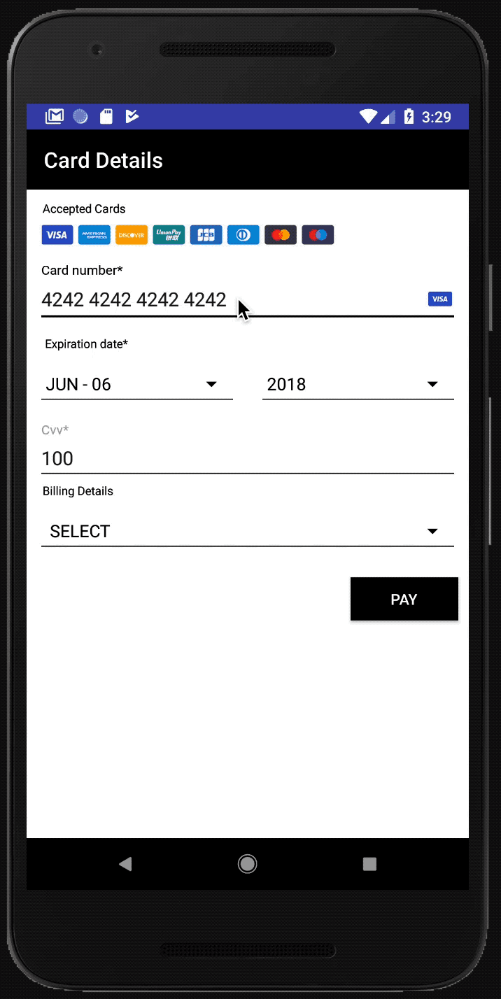

# Frames Android SDK
[](https://circleci.com/gh/checkout/frames-android/tree/master)
[](https://jitpack.io/#checkout/frames-android)
[](LICENSE)

Start accepting online payments in just a few minutes with our Android SDK. It's quick and easy to integrate, accepts online payments from all major credit cards, and is customizable to your brand.


<div align="center">
    
</div>


## Requirements
- Android minimum SDK 21

> Compatibility verified with `targetSdk` versions 21 to 33


## Documentation

Frames for Android tokenises consumer data for use within [Checkout.com](https://www.checkout.com)'s payment infrastructure. We want to abstract all the complexity in taking payments and building a payment screen from your Mobile Application and allow you to focus on your core business.

- [Integration](#Integration): _a guide for consuming our SDK in your Android app_

- [Demo projects](#Demo-projects): _We've created projects showcasing the range of functionality available in our SDKs while testing each distribution method offered_

- [Get started](#Get-started): _Start testing what you can achieve by presenting inside your Applications UI_

- [Make it your own](#Make-it-your-own): _Customising the UI to become a part of your app_

- [Other features](#Other-features): _How we help with Google Pay & 3D Secure Challenges_

- [Migrating](#Migrating): _If you have used 3.5.x version before_

- [License](#License)


You can find the Frames API reference [on our KDoc](https://checkout.github.io/frames-android/index.html).


## Integration

Add JitPack repository to the project level `build.gradle` file:
```groovy
// project gradle file
allprojects {
    repositories {
        maven { url 'https://jitpack.io' }
    }
}
```

Add Frames SDK dependency to the module gradle file:
```groovy
// module gradle file
dependencies {
    implementation 'com.github.checkout:frames-android:<latest_version>'
}
```


> You can find more about the installation and available versions on [](https://jitpack.io/#checkout/frames-android)

> Please keep in mind that the Jitpack repository should to be added to the project gradle file while the dependency should be added in the module gradle file. (More about build configuration files is available [here](https://developer.android.com/studio/build))


## Demo projects
We've worked with Product and Design to create simple demo applications that showcase our SDKs, that you'll be able to run locally as soon as you clone the repository.

You will find our demo apps in the root of the repository, inside respective folders:
- `app` - Java and Imperative UI. Covers default style and 3DS.
- `example_app_frames` - Kotlin and Declarative UI. Covers: default and custom style, theming, 3DS and Google Pay.

Once running `example_app_frames`, you will find the home screen with a number of design options. We have tried to make them pretty contrasting to give your UI/UX teammates an idea of what can be achieved. We've also tried to write the code in the simplest way to track and understand how each UI flavour was created. Just start from `HomeScreen.kt` and follow the button actions in code for some examples on how we achieve those UIs.


## Get started
If you got here, we'll either assume you've completed Integration or you're just curious. If none, then please complete [Integration](#Integration) first.

### Step 1: Create a callback for the Payment flow
```kotlin
val paymentFlowHandler = object : PaymentFlowHandler {
    override fun onSubmit() {
        // form submit initiated; you can potentially display a loader
    }
    override fun onSuccess(tokenDetails: TokenDetails) {
        // your token is here
    }
    override fun onFailure(errorMessage: String) {
        // token request error
    }
    override fun onBackPressed() {
        // the user decided to leave the payment page
    }
}
```

### Step 2: Create a configuration object for your Payment form
```kotlin
val paymentFormConfig = PaymentFormConfig(
    publicKey = PUBLIC_KEY,                     // set your public key
    context = context,                          // set context
    environment = Environment.SANDBOX,          // set the environment
    paymentFlowHandler = paymentFlowHandler,    // set the callback
    style = PaymentFormStyle(),                 // set the style
    supportedCardSchemeList = emptyList()       // set supported card schemes, by default uses all schemes
)
```

### Step 3: Create a Payment mediator
```kotlin
val paymentFormMediator = PaymentFormMediator(paymentFormConfig)
```

### Step 4: Use a Payment form mediator to get and show Payment form

#### With Compose UI
```kotlin
paymentFormMediator.PaymentForm()               // Compose function
```

#### With Activity
```kotlin
override fun onCreate(savedInstanceState: Bundle?) {
    super.onCreate(savedInstanceState)
    paymentFormMediator.setActivityContent(this)
}
```

#### With Fragment
```kotlin
override fun onCreateView(
    inflater: LayoutInflater,
    container: ViewGroup?,
    savedInstanceState: Bundle?
): View = paymentFormMediator.provideFragmentContent(this)
```

## Make it your own
<sub>!!! Any customisation needs to be done before creating Payment form mediator. Once mediator is created, any changes done on style will not be reflected in the UI !!!</sub>

We have been working hard to provide a selection of ways to make it your own. In order of complexity we'll start with:

### Modify Default
In our [Get started](#Get-started) example we have used Default Style to get something working quickly. If that was mostly what you were looking for, then modify individual properties should be the best option for you.

```kotlin
val paymentFormStyle = PaymentFormStyle()
val customInputComponentStyle = DefaultLightStyle.inputComponentStyle(
    titleTextId = R.string.custom_card_number_title,
    withLeadingIcon = true,
    margin = Margin(bottom = 16)
)
paymentFormStyle.paymentDetailsStyle.cardNumberStyle.inputStyle = customInputComponentStyle
```

### Use Theme
Detailed implementation of this approach can be found in `CustomPaymentFormTheme.kt`. With the Theme, we are aiming to give you a design system that you can use to create the full UI style by providing a small number of properties that we will share across to sub components. Since you might not fully agree with our mapping, you can still individually change each component afterwards (as in the Modify Default example).

```kotlin
val theme = PaymentFormTheme(
    paymentFormThemeColors = paymentFormThemeColors,
    /**
     * option 1: Use combination of default and custom components
     */
    paymentFormComponents = DefaultPaymentFormTheme.providePaymentFormComponents(
        cardNumber = cardNumber,
        addressLineOne = addressLineOne,
        addressLineTwo = addressLineTwo,
        addBillingSummaryButton = addBillingSummaryButton,
        editBillingSummaryButton = editBillingSummaryButton
    ),
    /**
     * option 2: Use default components
     * paymentFormComponents = DefaultPaymentFormTheme.provideComponents()
     */
    paymentFormShape = PaymentFormShape(
        inputFieldShape = Shape.RoundCorner,
        addressSummaryShape = Shape.Rectangle, buttonShape = Shape.Circle
    ),
    paymentFormCornerRadius = PaymentFormCornerRadius(
        inputFieldCornerRadius = CornerRadius(INPUT_FIELD_CORNER_RADIUS),
        addressSummaryCornerRadius = CornerRadius(INPUT_FIELD_CORNER_RADIUS)
    )
)
val style = PaymentFormStyleProvider.provide(theme)
```
We think this approach should hit a good balance between great control of UI & simple, concise code. However if you still find the mapping to need excessive customisation, our final approach may be more to your liking.

### Declare all components
This is by no means the easy way, but it is absolutely the way to fully customise every property, and discover the full extent of customisability as you navigate through.

```kotlin
val paymentDetailsStyle: PaymentDetailsStyle = PaymentDetailsStyle(
    paymentDetailsHeaderStyle = ScreenHeaderStyle(..),
    cardSchemeStyle = CardSchemeComponentStyle(..),
    cardNumberStyle = CardNumberComponentStyle(..),
    expiryDateStyle = ExpiryDateComponentStyle(..),
    cvvStyle = CvvComponentStyle(..),
    addressSummaryStyle = AddressSummaryComponentStyle(..),
    payButtonStyle = PayButtonComponentStyle(..),
    fieldsContainerStyle = ContainerStyle(..)
)
val billingFormStyle: BillingFormStyle = BillingFormStyle(..)
val paymentFormStyle = PaymentFormStyle(paymentDetailsStyle, billingFormStyle)
```
To use some of our default component styles during custom style creation please take a look on: `DefaultTextStyle.kt`, `DefaultButtonStyle.kt`, `DefaultImageStyle.kt`,`DefaultTextLabelStyle.kt`,`DefaultTextStyle.kt`,`DefaultLightStyle.kt`,`...`.

## Other features

### Handle 3D Secure
When you send a 3D secure charge request from your server you will get back a 3D Secure URL. This is available from `_links.redirect.href` within the JSON response. You can then pass the 3D Secure URL to a `PaymentFormMediator` in order to handle the verification.

The redirection URLs (`success_url` and `failure_url`) are set in the Checkout.com Hub, but they can be overwritten in the charge request sent from your server. It is important to provide the correct URLs to ensure a successful payment flow.
Example of 3DS handling can be found in demo `app`, `DemoActivity.java`.

#### Step 1: Create 3DS result handler
```kotlin
val threeDSResultHandler: ThreeDSResultHandler = { threeDSResult: ThreeDSResult ->
    when (threeDSResult) {
        // Used when [ProcessThreeDSRequest.redirectUrl] contains [ThreeDSRequest.successUrl]
        is ThreeDSResult.Success -> { 
            /* Handle success result */
            threeDSResult.token
        }
        // Used when [ProcessThreeDSRequest.redirectUrl] contains [ThreeDSRequest.successUrl]
        is ThreeDSResult.Failure -> { /* Handle failure result */ }
        // Used when [ProcessThreeDSRequest.redirectUrl] can't be parsed or when error received from 3DS WebView
        is ThreeDSResult.Error -> { 
            /* Handle success result */
            threeDSResult.error
        }
    }
}
```

#### Step 2: Handle 3DS
```kotlin
val request = ThreeDSRequest(
    container = findViewById(android.R.id.content), // Provide a ViewGroup container for 3DS WebView
    challengeUrl = redirectUrl,                     // Provide a 3D Secure URL
    successUrl = "http://example.com/success",
    failureUrl = "http://example.com/failure",
    resultHandler = threeDSResultHandler
)
paymentFormMediator.handleThreeDS(request)
```

### Handle GooglePay
Handle a Google Pay token payload and retrieve a token, that can be used to create a charge from your backend.

#### Step 1: Create CheckoutApiService
```kotlin
val checkoutApiClient = CheckoutApiServiceFactory.create(
    publicKey = PUBLIC_KEY,                     // set your public key
    environment = Environment.SANDBOX,          // set context
    context = context                           // set the environment
)
```

#### Step 2: Create a token for GooglePay
```kotlin
val request = GooglePayTokenRequest(
    tokenJsonPayload = tokenJsonPayload,
    onSuccess = { tokenDetails ->
       /* Handle success result */
        tokenDetails.token
    },
    onFailure = { errorMessage ->
        /* Handle failure result */
    }
)
checkoutApiClient.createToken(request)
```

## Migrating
3DS and GooglePay processing remain unaffected so using them should still work the same.

If you're using Frames Android from versions prior to v4 (we would strongly recommend using the latest release), this update will bring breaking changes that'll require a little development time.

Because of our efforts to greatly improve the UI of the Frames and enabling you to customise it to such extents, the approach required is very different. This will require you to:
- remove usage of Frames older version from your code base. This may be an opportunity to remove a screen as well, or a few other objects that were created only to support older Frames integration!
- [Get started](#Get-started)


We would like to point out the great benefits that we think v4+ brings to our SDK, like:

- customisable UI focussed on enabling your users to seamlessly transition through the payment flow
- updated and improved validation logic, in line with our supported card payment methods
- using our updated UIs provides added security benefits to your customers

## License

Frames Android is released under the [MIT license](LICENSE).
